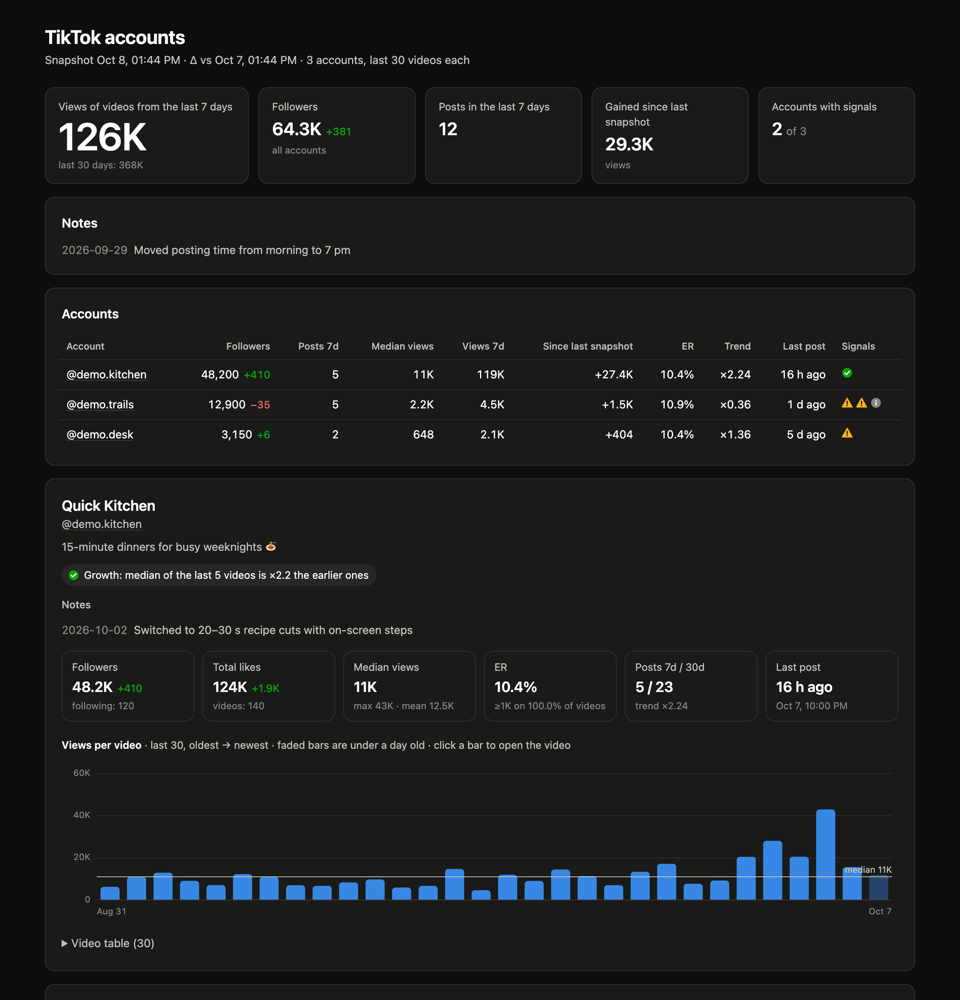

# TikTok Analytics

[](https://github.com/yartsun/tiktok-analytics/actions/workflows/ci.yml)

Track several TikTok accounts from the command line. One command collects public profile and video stats,
compares them with the previous run and builds an HTML dashboard plus Markdown and JSON reports that you can
paste straight into an LLM.



<sub>Dashboard built from the synthetic demo data (`--demo`).</sub>

## Features

- **One command, four outputs** — dashboard, full report for LLMs, brief report, JSON
- **Deltas between runs** — followers, likes and views gained per video since the last snapshot
- **Signals** — stale accounts, fresh videos stuck below the view floor, drops and growth in median views,
  follower loss, profile edits, handle changes
- **Notes log** — write down what you changed (posting time, format, bio); notes appear next to the numbers,
  so you or an LLM can connect cause and effect
- **Survives handle changes** — accounts are found again by their permanent `secUid`
- **No API keys, no login** — public data only, a single-file Python script

## Quick start

You only need [uv](https://docs.astral.sh/uv/): it installs the dependencies (yt-dlp, curl_cffi) on the first run.

```bash
uv run tiktok_stats.py --demo --open    # try it on synthetic data, no network
cp accounts.example.txt accounts.txt    # then list your accounts, one per line
uv run tiktok_stats.py --open
```

## Usage

```bash
uv run tiktok_stats.py some_user @other_user   # one-off run without accounts.txt
uv run tiktok_stats.py -n 50                   # analyze the last 50 videos instead of 30
uv run tiktok_stats.py --md                    # print the LLM report to stdout
uv run tiktok_stats.py --md --brief            # shorter report without per-video tables
uv run tiktok_stats.py --json                  # JSON to stdout, for scripts and bots
uv run tiktok_stats.py --cached                # rebuild reports from the last snapshot, no requests
```

| Output | For |
|---|---|
| `out/dashboard.html` | you: totals, account table, views chart per video, sortable video tables, light and dark theme |
| `out/report.md` | LLMs: every number in compact Markdown, paste it into a chat as is |
| `out/report_brief.md` | the same without per-video tables |
| `out/report.json` | scripts and bots |
| `out/history/*.json` | one snapshot per run; deltas are computed from these |

## Notes log

Copy `notes.example.txt` to `notes.txt` and add a line whenever you change something:

```
2026-10-03 @your_account: added a link to the bio
2026-10-05: started posting in the evening instead of the morning
```

A line without `@handle` applies to all accounts. The script also notices profile edits (name, bio, link,
privacy) and handle changes between snapshots on its own.

## Ask an LLM

Send `out/report.md` (or `report_brief.md`) with a question like:

> Here are the stats of my TikTok accounts. Which formats and captions work best, which accounts are dropping
> and why, and what should I post this week?

With [Claude Code](https://claude.com/claude-code), open the folder and ask it to analyze the accounts:
`CLAUDE.md` explains how. Keep your own rules in `CLAUDE.local.md`, which is git-ignored.

## Run it daily

Daily snapshots make the deltas meaningful. With cron:

```bash
0 9 * * * cd /path/to/tiktok-analytics && uv run tiktok_stats.py >> out/daily.log 2>&1
```

On macOS a launchd agent works too and catches up on a run missed while the Mac was asleep.

## How the metrics work

- **ER** = (likes + comments + shares + saves) / views.
- **Median views**, **hit rate** (share of videos with ≥1K and ≥10K views) and **trend** use only videos older
  than 24 hours: fresh ones are still gathering views.
- **Trend** = median of the last 5 videos / median of the rest. Below 1 is a drop, above 1 is growth.
- **Views 7d / 30d** = total views of the videos published in the last 7 / 30 days.
- Signal thresholds are constants at the top of `tiktok_stats.py`.

## Limitations

- Public data only: followers, likes and per-video views, comments, shares and saves. Watch time, retention,
  traffic sources and demographics are only available in TikTok Studio or the official API.
- TikTok rounds large numbers (for example 1.5M).
- The script reads public web pages, and TikTok may answer with a bot check instead of profile data, especially
  after frequent runs or on some networks. Such accounts appear in the report with an error. Keep runs
  infrequent and respect TikTok's terms of service.

## Development

```bash
uv run --no-project --with pytest pytest
uvx ruff check .
```

## License

[MIT](LICENSE)
